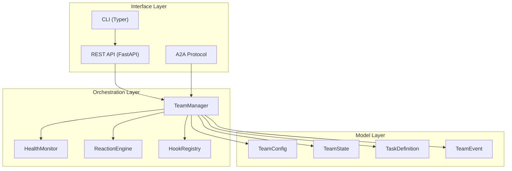
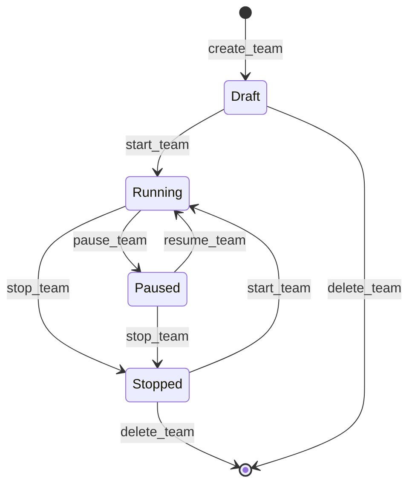
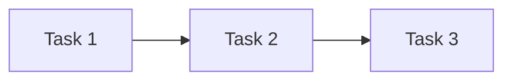
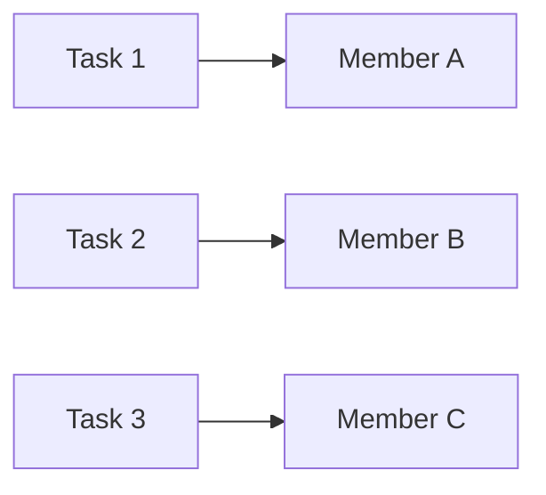
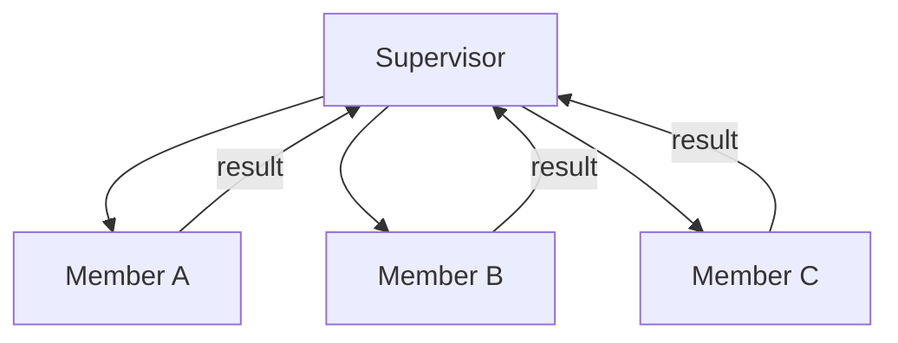

# Architecture

Agent Teams is structured as a layered system with clean separation between orchestration, protocol, and transport.

## Module Overview

| Module | Purpose |
|--------|---------|
| `types.py` | Pydantic models — team config, members, tasks, events, metrics |
| `manager.py` | `TeamManager` — central orchestrator for team lifecycle |
| `health.py` | `HealthMonitor` — heartbeat tracking, stuck detection, recovery |
| `reactions.py` | `ReactionEngine` — automated event responses with retry & escalation |
| `hooks.py` | `HookRegistry` — lifecycle hooks with priority and short-circuit |
| `app.py` | FastAPI application factory |
| `cli.py` | Typer CLI |
| `a2a/` | A2A protocol bridge (storage, worker, channel, extensions) |

## Layered Design

## Team Lifecycle

Teams follow a state machine from creation through deletion:

## Execution Modes

Teams support three execution modes:

### Sequential

Tasks are executed one at a time, in order. Each task completes before the next begins.

### Parallel

All tasks execute concurrently across available members.

### Supervisor

A designated supervisor member coordinates task distribution, reviews results, and can reassign work.

## Design Patterns

Agent Teams draws on patterns from two production systems:

### From Gastown (Go)

- **Heartbeat-based health** — Each member sends periodic heartbeats; the monitor transitions through `healthy → stale → unresponsive → dead`.
- **GUPP (progress tracking)** — Members must make progress on assigned tasks, not just stay alive. The `stuck` state detects members that respond to heartbeats but produce no results.
- **Mass death detection** — When multiple members die within a short window (30s default), a mass-death callback fires for coordinated recovery.
- **Exponential backoff restarts** — Failed members are restarted with exponentially increasing delays.

### From Agent Orchestrator (TypeScript)

- **Reaction engine** — Automatic responses to events (task-failed, member-dead, etc.) with configurable retry limits and time-based escalation.
- **Lifecycle hooks** — Priority-ordered hooks at every team event boundary, with the ability to block operations.
- **Push-not-pull** — The system proactively handles routine issues and only escalates to humans when judgement is needed.
