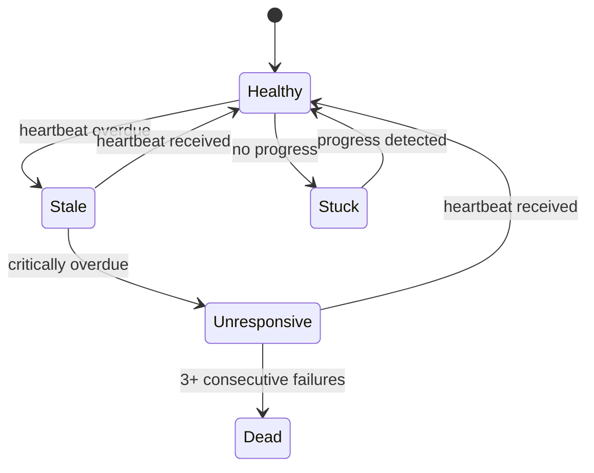

# Health Monitoring

The `HealthMonitor` provides heartbeat-based liveness detection, stuck-agent identification, and automatic recovery for team members.

## Health States

Each member transitions through these states:



| State | Meaning |
|-------|---------|
| `healthy` | Heartbeat is recent, making progress |
| `stale` | Heartbeat overdue but within grace period |
| `unresponsive` | Heartbeat critically overdue |
| `stuck` | Heartbeat OK but no task progress |
| `dead` | 3+ consecutive check failures |

## Configuration

```python
from agent_teams.health import HealthConfig

config = HealthConfig(
    heartbeat_interval=30.0,      # Expected seconds between heartbeats
    stale_threshold=90.0,         # Stale after this many seconds
    unresponsive_threshold=300.0, # Unresponsive after this
    stuck_threshold=600.0,        # Stuck if no progress for this long
    max_restart_attempts=3,       # Max auto-restarts per member
    backoff_base=2.0,             # Exponential backoff base
    check_interval=15.0,          # Health check loop interval
)
```

## Basic Usage

```python
from agent_teams.health import HealthMonitor, HealthConfig

monitor = HealthMonitor(config=HealthConfig())

# Register members
monitor.register("agent-1")
monitor.register("agent-2")

# Record heartbeats (called by agents periodically)
monitor.record_heartbeat("agent-1")

# Record progress (called when a task produces results)
monitor.record_progress("agent-1")

# Start the monitoring loop
await monitor.start()

# Check for unhealthy members
unhealthy = monitor.get_unhealthy()
for member in unhealthy:
    print(f"{member.member_id}: {member.state.value}")

# Stop monitoring
await monitor.stop()
```

## Callbacks

Attach callbacks to react to health state changes:

```python
monitor = HealthMonitor(config=HealthConfig())

def on_stale(member_id: str) -> None:
    print(f"⚠️ {member_id} is stale")

def on_dead(member_id: str) -> None:
    print(f"💀 {member_id} is dead — attempting restart")

monitor.on_stale = on_stale
monitor.on_unresponsive = lambda mid: print(f"🔴 {mid} is unresponsive")
monitor.on_stuck = lambda mid: print(f"🔄 {mid} is stuck")
monitor.on_dead = on_dead
monitor.on_mass_death = lambda ids: print(f"🚨 Mass death: {ids}")
```

## Restart with Backoff

The monitor tracks restart attempts and enforces exponential backoff:

```python
if monitor.can_restart("agent-1"):
    # Perform restart logic...
    monitor.record_restart("agent-1")
    # Backoff delay = backoff_base ^ restart_count
    # 1st restart: 2^0=1s, 2nd: 2^1=2s, 3rd: 2^2=4s, etc.
```

Once `restart_count >= max_restart_attempts`, `can_restart()` returns `False` and the member should be escalated.

## Mass Death Detection

Inspired by Gastown's daemon monitoring, when 3 or more members die within a 30-second window, the `on_mass_death` callback fires. This allows coordinated recovery instead of individual restarts:

```python
def handle_mass_death(dead_ids: list[str]) -> None:
    """Multiple members died simultaneously — possible infrastructure issue."""
    notify_ops_team(f"Mass death detected: {dead_ids}")

monitor.on_mass_death = handle_mass_death
```

## Integration with TeamManager

When using `TeamManager`, health monitoring is wired automatically:

```python
from agent_teams.manager import TeamManager
from agent_teams.health import HealthConfig

manager = TeamManager(
    health_config=HealthConfig(
        stale_threshold=60.0,
        stuck_threshold=300.0,
    )
)
```

The manager:
1. Creates a `HealthMonitor` per team on `start_team()`
2. Registers all team members
3. Wires health callbacks to the reaction engine
4. Stops the monitor on `stop_team()`
