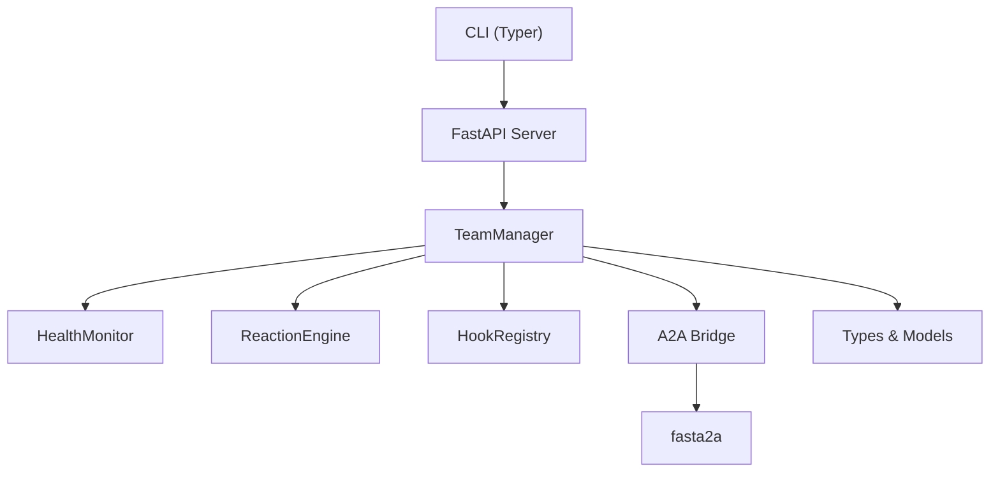

import DocCardList from '@theme/DocCardList';

# 🤖 👥 Agent Teams

**Agent Teams** is a Python library for orchestrating teams of AI agents built on [pydantic-ai](https://ai.pydantic.dev/) with coordination over the [A2A protocol](https://a2a-protocol.org). It brings production-grade patterns from distributed systems to multi-agent coordination.

## Key Features

- **Team Lifecycle Management** — Create, start, stop, pause, resume, and delete agent teams via a REST API or CLI.
- **Execution Modes** — Sequential, parallel, and supervisor-driven task execution.
- **Health Monitoring** — Heartbeat-based liveness detection, stuck-agent identification, mass death handling, and exponential-backoff restarts.
- **Reaction Engine** — Automatic event handling with retry logic, escalation, and configurable responses (notify, reassign, restart).
- **Lifecycle Hooks** — Priority-ordered, short-circuit-capable hooks for every major team event.
- **A2A Protocol Extensions** — Team coordination metadata as a first-class [A2A extension](https://a2a-protocol.org/latest/topics/extensions).
- **Typer CLI** — Full-featured command-line interface for managing teams without writing code.
- **FastAPI REST API** — Embeddable or standalone API server with SSE event streaming.

## Architecture at a Glance



## Installation

```bash
pip install agent-teams
```

For development (with test dependencies):

```bash
pip install -e ".[test]"
```

## Quick Example

```python
from agent_teams.types import TeamConfig, AgentMemberConfig, ExecutionMode
from agent_teams.manager import TeamManager

manager = TeamManager()

# Create a team
config = TeamConfig(
    name="research-team",
    execution_mode=ExecutionMode.PARALLEL,
    members=[
        AgentMemberConfig(name="researcher", model="openai:gpt-4o"),
        AgentMemberConfig(name="writer", model="anthropic:claude-sonnet-4-20250514"),
    ],
)
team = await manager.create_team(config)

# Start and assign work
await manager.start_team(team.team_id)
result = await manager.assign_task(team.team_id, "Analyse recent AI papers")
```

Or use the CLI:

```bash
# Start the server
agent-teams serve --port 8765

# Create and run a team
agent-teams local create team.yaml
agent-teams local start <team-id>
agent-teams local assign <team-id> "Analyse recent AI papers"
```

## Documentation

<DocCardList />
