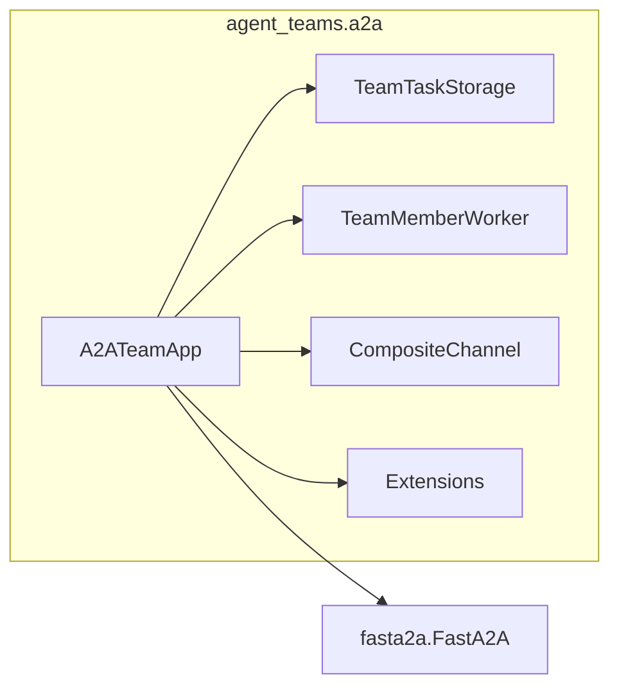

# A2A Protocol & Extensions

Agent Teams implements coordination as an [A2A protocol extension](https://a2a-protocol.org/latest/topics/extensions), enabling teams to communicate over the standard Agent-to-Agent protocol with additional team-specific metadata.

## A2A Overview

The [Agent-to-Agent (A2A) protocol](https://a2a-protocol.org) is a standard for inter-agent communication. It defines:

- **Agent Cards** — JSON descriptions of agent capabilities
- **Tasks** — Units of work exchanged between agents
- **Messages** — Request/response payloads with text and file parts
- **Artifacts** — Output produced by task execution

Agent Teams uses [fasta2a](https://github.com/datalayer/fasta2a) as its A2A transport layer.

## Team Coordination Extension

Agent Teams declares a custom A2A extension for team coordination metadata:

```
URI: https://datalayer.io/ext/team-coordination/v1
Type: data-only (adds metadata to tasks, does not define new methods)
```

### Agent Card

The extension is declared in the agent card's `capabilities.extensions` field:

```json
{
  "name": "Research Team",
  "capabilities": {
    "extensions": [
      {
        "uri": "https://datalayer.io/ext/team-coordination/v1",
        "description": "Agent Teams coordination metadata for multi-agent task management"
      }
    ]
  }
}
```

### Extension Activation

Clients activate the extension by setting the `A2A-Extensions` HTTP header:

```
A2A-Extensions: https://datalayer.io/ext/team-coordination/v1
```

When activated, task metadata may include team coordination fields.

### Task Metadata

Tasks carry team-specific metadata with the `x-datalayer-team-` prefix:

```python
from agent_teams.a2a.extensions import make_task_metadata

metadata = make_task_metadata(
    team_id="team-abc",
    assigned_to="agent-1",
    priority="high",
    depends_on=["task-001", "task-002"],
    execution_mode="parallel",
    role_hint="researcher",
)
# Returns:
# {
#     "x-datalayer-team-id": "team-abc",
#     "x-datalayer-team-assigned-to": "agent-1",
#     "x-datalayer-team-priority": "high",
#     "x-datalayer-team-depends-on": '["task-001", "task-002"]',
#     "x-datalayer-team-execution-mode": "parallel",
#     "x-datalayer-team-role-hint": "researcher",
# }
```

### Health Metadata

Health state can be attached to tasks for observability:

```python
from agent_teams.a2a.extensions import make_health_metadata

metadata = make_health_metadata(
    member_id="agent-1",
    state="healthy",
    last_heartbeat="2025-01-15T10:30:00Z",
    consecutive_failures=0,
)
```

### Reaction Metadata

Reaction events are also expressible as task metadata:

```python
from agent_teams.a2a.extensions import make_reaction_metadata

metadata = make_reaction_metadata(
    trigger="task-failed",
    action="reassign",
    target_id="task-123",
    attempt=2,
    escalated=False,
)
```

### Reading Extension Metadata

```python
from agent_teams.a2a.extensions import (
    extract_team_metadata,
    is_team_extension_active,
)

# Extract team metadata from any dict with x-datalayer-team-* keys
raw = {"x-datalayer-team-id": "team-abc", "other-key": "ignored"}
team_meta = extract_team_metadata(raw)
# {"team-id": "team-abc"}

# Check if the extension is active on a request
if is_team_extension_active(request_headers):
    # Include team metadata in responses
    pass
```

## A2A Bridge Architecture

The bridge between Agent Teams and A2A consists of four modules:



| Module | Purpose |
|--------|---------|
| `storage.py` | Maps A2A task states to team task states |
| `worker.py` | Executes tasks via team members |
| `channel.py` | Bridges team channels to A2A message flow |
| `extensions.py` | Team coordination extension metadata |
| `application.py` | `A2ATeamApp` — assembles the A2A server |

## Running the A2A Server

```python
from agent_teams.a2a import A2ATeamApp

a2a_app = A2ATeamApp(
    team_config=config,
    name="My Team",
    description="Multi-agent research team",
)

# Use with uvicorn
import uvicorn
uvicorn.run(a2a_app.app, port=8765)
```
