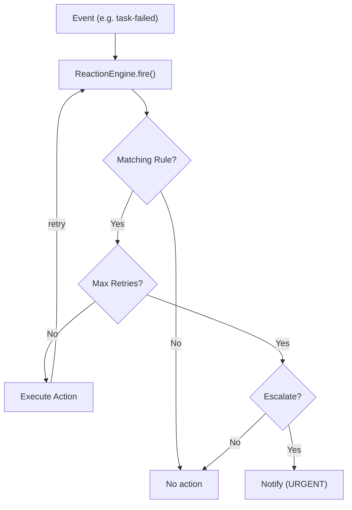

# Reaction Engine

The `ReactionEngine` provides automatic event handling with retry logic, escalation, and configurable responses. It is inspired by the agent-orchestrator's reaction system.

## Concept

When something goes wrong — a task fails, a member dies, a member gets stuck — the reaction engine automatically fires configured responses. If the response doesn't resolve the issue after enough retries, it escalates.



## Triggers

| Trigger | When it fires |
|---------|---------------|
| `task-failed` | A task execution fails |
| `task-stuck` | A task makes no progress |
| `member-unresponsive` | A member stops sending heartbeats |
| `member-stuck` | A member is alive but not progressing |
| `member-dead` | A member dies (3+ consecutive failures) |
| `all-complete` | All tasks in a team are done |
| `mass-death` | Multiple members die within a window |

## Actions

| Action | Effect |
|--------|--------|
| `notify` | Send a notification (via notify handler) |
| `send-to-agent` | Send a message to a specific agent |
| `reassign` | Reassign the task to another member |
| `restart-member` | Restart the failed member |
| `auto-merge` | Auto-merge results (for completed tasks) |
| `custom` | Call a custom handler function |

## Configuration

```python
from agent_teams.reactions import (
    ReactionConfig,
    ReactionEngine,
    ReactionAction,
    ReactionPriority,
    ReactionTrigger,
)

engine = ReactionEngine()

# Notify on task failure with up to 3 retries
engine.add_rule(ReactionConfig(
    trigger=ReactionTrigger.TASK_FAILED,
    action=ReactionAction.NOTIFY,
    priority=ReactionPriority.ACTION,
    max_retries=3,
    escalate_after_retries=2,
    message_template="Task {target_id} failed",
))

# Restart unresponsive members
engine.add_rule(ReactionConfig(
    trigger=ReactionTrigger.MEMBER_UNRESPONSIVE,
    action=ReactionAction.RESTART_MEMBER,
    max_retries=2,
))

# Reassign tasks from dead members
engine.add_rule(ReactionConfig(
    trigger=ReactionTrigger.MEMBER_DEAD,
    action=ReactionAction.REASSIGN,
))
```

## Handlers

Wire up handlers so the engine knows *how* to execute each action:

```python
async def notify(trigger, target_id, priority, message, context):
    print(f"[{priority.value}] {message}")

async def send_message(target_id, message, context):
    await channel.send(target_id, message)

async def reassign(target_id, context):
    await manager.reassign_task(target_id)

async def restart(target_id, context):
    await manager.restart_member(target_id)

engine.set_notify_handler(notify)
engine.set_send_handler(send_message)
engine.set_reassign_handler(reassign)
engine.set_restart_handler(restart)
```

## Firing Reactions

```python
# Fire a reaction (typically called by the health monitor or task executor)
await engine.fire(ReactionTrigger.TASK_FAILED, "task-123")

# Fire returns True if an action was executed, False otherwise
result = await engine.fire(ReactionTrigger.MEMBER_DEAD, "agent-2")
```

## Retry and Escalation

The engine tracks reaction state per trigger+target pair:

- **Retries**: Each `fire()` increments the attempt counter for that trigger/target. When `attempt_count > max_retries`, the reaction stops.
- **Escalation**: After `escalate_after_retries` attempts **or** `escalate_after_seconds` elapsed, the reaction escalates to `URGENT` priority and notifies.

```python
# After 2 retries, escalate to urgent
engine.add_rule(ReactionConfig(
    trigger=ReactionTrigger.TASK_STUCK,
    action=ReactionAction.NOTIFY,
    priority=ReactionPriority.WARNING,
    max_retries=5,
    escalate_after_retries=2,
    escalate_after_seconds=1800,  # or 30 minutes
))
```

## Resolving Reactions

When the issue is fixed (e.g., the task succeeds on retry), resolve the reaction state:

```python
engine.resolve(ReactionTrigger.TASK_FAILED, "task-123")
```

This prevents further retries on the resolved trigger/target pair.

## Custom Handlers

For application-specific logic, use the `CUSTOM` action:

```python
async def auto_merge_results(target_id, context):
    """Custom handler to merge results when all tasks complete."""
    results = context.get("results", [])
    merged = combine_results(results)
    await store.save(target_id, merged)

engine.add_rule(ReactionConfig(
    trigger=ReactionTrigger.ALL_COMPLETE,
    action=ReactionAction.CUSTOM,
    custom_handler=auto_merge_results,
))
```
